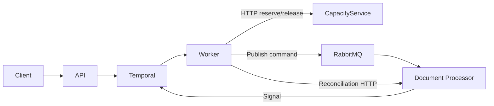

# Temporal .NET Showcase

A small, deliberately simple .NET application that demonstrates the core ideas behind
[Temporal](https://temporal.io/) using a realistic-but-toy business scenario: processing an
uploaded document through a chain of asynchronous, unreliable services. It is a learning project,
not a production template - if you have never used Temporal before, this is meant to be the
fastest way to see *why* it exists and *what problems it solves*.

## 1. What this project demonstrates

- **Temporal is the orchestrator.** It durably tracks every step of the document-processing
  business process, retries failed steps, waits for external signals, and survives crashes.
- **RabbitMQ transports an asynchronous command.** The worker publishes a `ProcessDocument`
  command; a separate processor consumes it whenever it is ready.
- **HTTP represents synchronous service-to-service communication.** The workflow calls a
  capacity-reservation service and, if needed, queries a processor's status endpoint.
- **The worker executes workflow and activity code.** It is the only process that runs Temporal
  workflow/activity logic; the API only starts, queries, and cancels workflows.
- **Temporal stores durable workflow history.** Every step above is recorded as an event, which is
  how a crashed worker can resume a workflow exactly where it left off.

## 2. Architecture



| Component | Responsibility |
|---|---|
| `TemporalShowcase.Api` | ASP.NET Core API. Starts, queries, and cancels workflows. No orchestration logic. |
| `TemporalShowcase.Worker` | Hosts the Temporal worker: runs the workflow and all activities. |
| `TemporalShowcase.CapacityService` | Fake external dependency. Reserves/releases "processing capacity", idempotently, with optional simulated failures. |
| `TemporalShowcase.DocumentProcessor` | Consumes RabbitMQ commands, simulates document processing, signals Temporal, and exposes a status endpoint used for reconciliation. |
| `TemporalShowcase.Contracts` | Shared DTOs: API contracts, RabbitMQ messages, workflow input/result types. No logic. |
| `TemporalShowcase.Application` | The actual Temporal workflow and activity implementations, shared by the Worker and the API (for typed workflow calls). |

## 3. Temporal concepts, explained through this app

| Concept | Where it shows up here |
|---|---|
| **Workflow** | `DocumentProcessingWorkflow` - the durable function that orchestrates the whole process. |
| **Activity** | `DocumentProcessingActivities` - the only place that performs HTTP calls or RabbitMQ publishes. |
| **Worker** | `TemporalShowcase.Worker` polls the `document-processing` task queue and executes workflow/activity code. |
| **Task queue** | `document-processing` - the queue name the API starts workflows on and the worker listens on. |
| **Workflow ID** | `document-processing-{documentId}` - starting the same document twice returns `409 Conflict` instead of a second run. |
| **Event history** | Every activity call, signal, and timer for a workflow run, visible in the Temporal Web UI. |
| **Replay** | After a crash, Temporal reconstructs a workflow's in-memory state by re-running its code against the recorded history - this is why workflow code must be deterministic. |
| **Determinism** | See the comment block at the top of `DocumentProcessingWorkflow.cs`. No `DateTime.UtcNow`, `Guid.NewGuid`, `Task.Delay`, HTTP, or RabbitMQ calls directly in workflow code. |
| **Retry policy** | Configured per-activity in `ActivityRetryPolicies` (e.g. capacity reservation retries transient HTTP 5xx errors, up to 5 attempts). |
| **Timeout** | Every activity call has a `StartToCloseTimeout`. |
| **Durable timer** | `Workflow.WaitConditionAsync(..., timeout)` while waiting for the completion signal, and the delay between reconciliation attempts. |
| **Signal** | `DocumentProcessedAsync` - the processor tells the workflow processing has finished. |
| **Query** | `GetState` - lets the API read the workflow's current progress without affecting its execution. |
| **Cancellation** | `POST /api/documents/{workflowId}/cancel` requests cancellation; the workflow releases capacity if it had already reserved it. |
| **Compensation** | If processing fails permanently (or the workflow is cancelled after reserving capacity), the workflow calls `ReleaseCapacityActivity` to undo the reservation. |
| **Reconciliation** | If the completion signal never arrives, the workflow falls back to polling the processor's HTTP status endpoint. |

Two ideas worth calling out explicitly:

- **Temporal retries activities, not arbitrary code.** Only code inside an `[Activity]` method gets
  automatic retries; the workflow method itself just describes the steps.
- **Activity execution is at-least-once.** A worker crash after an activity finishes but before
  Temporal records that fact causes the activity to run again. Every activity in this project is
  written to be safe to repeat (idempotent reservations, deduplicated RabbitMQ commands).

## 4. Temporal vs. RabbitMQ - not competitors

- **Temporal** coordinates and durably tracks one long-running business process end-to-end: what
  step it's on, what to retry, what timers are pending, what the final outcome was.
- **RabbitMQ** transports messages between components. It knows nothing about "the document
  process" as a whole - it only knows it delivered a message.
- RabbitMQ alone cannot tell you "is document `abc123` still being processed, and why is it stuck
  on step 3?" - Temporal's event history and query support can.
- Temporal does not replace every messaging use case (e.g. high-throughput event streams,
  pub/sub fan-out) - here it deliberately delegates the "publish a command, have some other
  process consume it" job to RabbitMQ, and only owns the orchestration around it.

## 5. Running the application

Prerequisites: Docker Desktop (or another Docker Engine + Compose v2).

```powershell
docker compose up --build
```

Wait for all containers to report healthy (`docker compose ps`), then the following are available:

| Service | URL |
|---|---|
| API | http://localhost:8080 |
| API (Swagger UI) | http://localhost:8080/swagger |
| Temporal Web UI | http://localhost:8088 |
| RabbitMQ Management | http://localhost:15672 (guest / guest-local-dev-only) |

## 6. Running each scenario

The examples below use PowerShell's `Invoke-RestMethod`. A `curl` equivalent is included where the
syntax differs meaningfully.

### Successful execution

```powershell
$response = Invoke-RestMethod -Method Post -Uri http://localhost:8080/api/documents `
    -ContentType 'application/json' -Body '{ "fileName": "example.pdf" }'
$response
Invoke-RestMethod -Uri "http://localhost:8080$($response.statusUrl)"
```

### Activity retries (capacity service fails 3 times, then succeeds)

```powershell
$response = Invoke-RestMethod -Method Post -Uri http://localhost:8080/api/documents `
    -ContentType 'application/json' `
    -Body '{ "fileName": "retry-example.pdf", "simulateCapacityFailures": 3 }'
Invoke-RestMethod -Uri "http://localhost:8080$($response.statusUrl)"
```

### Missing signal and reconciliation

```powershell
$response = Invoke-RestMethod -Method Post -Uri http://localhost:8080/api/documents `
    -ContentType 'application/json' `
    -Body '{ "fileName": "reconciliation-example.pdf", "simulateLostCompletionSignal": true }'
Invoke-RestMethod -Uri "http://localhost:8080$($response.statusUrl)"
```

The workflow waits 10 seconds for the signal, then reconciles through HTTP - watch the `status`
field in the response change from `WaitingForCompletion` to `Reconciling` to `Completed` if you
poll the status URL a few times.

### Permanent processing failure (with compensation)

```powershell
$response = Invoke-RestMethod -Method Post -Uri http://localhost:8080/api/documents `
    -ContentType 'application/json' `
    -Body '{ "fileName": "failed-example.pdf", "simulateProcessingFailure": true }'
Invoke-RestMethod -Uri "http://localhost:8080$($response.statusUrl)"
```

### Cancelling a workflow

```powershell
Invoke-RestMethod -Method Post -Uri "http://localhost:8080$($response.statusUrl)/cancel"
```

### Combined scenarios

The three simulation flags are independent and can be combined in a single request, e.g. to
retry capacity twice, then reconcile via HTTP (since the signal is withheld), and discover a
permanent failure:

```powershell
$response = Invoke-RestMethod -Method Post -Uri http://localhost:8080/api/documents `
    -ContentType 'application/json' `
    -Body '{ "fileName": "example.pdf", "simulateCapacityFailures": 2, "simulateProcessingFailure": true, "simulateLostCompletionSignal": true }'
Invoke-RestMethod -Uri "http://localhost:8080$($response.statusUrl)"
```

### Scenario summary

| Scenario | Request body |
|---|---|
| Successful execution | `{ "fileName": "example.pdf" }` |
| Activity retries | `{ "fileName": "retry-example.pdf", "simulateCapacityFailures": 3 }` |
| Missing signal / reconciliation | `{ "fileName": "reconciliation-example.pdf", "simulateLostCompletionSignal": true }` |
| Permanent processing failure | `{ "fileName": "failed-example.pdf", "simulateProcessingFailure": true }` |
| Cancel a workflow | `POST /api/documents/{workflowId}/cancel` |
| Combined | any mix of `simulateCapacityFailures`, `simulateProcessingFailure`, `simulateLostCompletionSignal` |

At any point you can query a workflow's current state with `GET /api/documents/{workflowId}`, or
try all of the above interactively through Swagger at http://localhost:8080/swagger.

## 7. Inspecting the Temporal UI

Open http://localhost:8088 and:

1. Search for the workflow by its ID (`document-processing-<documentId>`, returned in the API
   response).
2. Open the workflow to see its **event history** - every activity call, timer, and signal.
3. Expand an `ActivityTaskScheduled`/`ActivityTaskStarted` sequence to find **activity failures and
   retry attempts** (visible for the retry scenario above).
4. Look for `TimerStarted`/`TimerFired` events to find the **durable timers** (the completion
   signal timeout and the reconciliation retry delay).
5. Look for `WorkflowExecutionSignaled` events to find **signals** delivered by the processor.
6. In the permanent-failure scenario, find the `ReleaseCapacityActivity` call near the end - this
   is the **compensation** step.
7. Query the workflow's `GetState` (via the API's GET endpoint, or the UI's "Query" tab) and check
   `reconciliationUsed` to see **whether reconciliation was used**.

## 8. Crash recovery demonstration

This shows that the worker owns no state itself - all of it lives in Temporal.

```powershell
# 1. Start a workflow.
$response = Invoke-RestMethod -Method Post -Uri http://localhost:8080/api/documents `
    -ContentType 'application/json' -Body '{ "fileName": "crash-demo.pdf" }'

# 2. Stop the worker mid-flight.
docker compose stop worker

# 3. Wait a few seconds, then confirm the workflow is not making progress.
Invoke-RestMethod -Uri "http://localhost:8080$($response.statusUrl)"

# 4. Start the worker again.
docker compose start worker

# 5. The workflow resumes from its durable history and completes normally.
Invoke-RestMethod -Uri "http://localhost:8080$($response.statusUrl)"
```

You can also restart the API itself (`docker compose restart api`) at any point and re-query the
same workflow - the API holds no workflow state; it only talks to Temporal.

## 9. Important reliability notes

- **HTTP timeouts can produce ambiguous outcomes.** A timed-out request may have actually
  succeeded on the server; this is why the capacity service's reserve/release operations are
  idempotent rather than relying on the caller's request having only ever been sent once.
- **RabbitMQ delivery can be duplicated.** The processor deduplicates by `MessageId` before doing
  any work.
- **Publisher confirms and consumer acknowledgements solve different reliability boundaries.**
  Confirms tell the *publisher* the broker durably has the message; acknowledgements tell the
  broker the *consumer* is done with it. Both are used here.
- **Activities must be idempotent** because Temporal executes them at-least-once.
- **This demo uses in-memory stores** (capacity reservations, processed message IDs, processing
  status) and is therefore **not production-safe** - restarting the capacity service or the
  document processor loses that state.
- **Production deduplication and external service state require durable storage** (a real
  database), not the `ConcurrentDictionary`-based stores used here.
- **Reconciliation should be designed around authoritative external state.** Here, the processor's
  status endpoint is treated as the source of truth when the signal is missing.
- **Temporal persistence should use an appropriate production database and deployment model** -
  the single-node Temporal server with a single Postgres instance in this compose file is a
  development convenience, not a production topology.

## 10. Running tests

```powershell
dotnet test
```

The workflow tests use Temporal's time-skipping test environment
(`Temporalio.Testing.WorkflowEnvironment`), so scenarios involving multi-second timers and retry
backoffs still run in seconds, not real time.

## 11. Cleanup

```powershell
docker compose down -v
```

This also removes the Temporal Postgres volume, so the next `docker compose up` starts from a
clean Temporal server.
